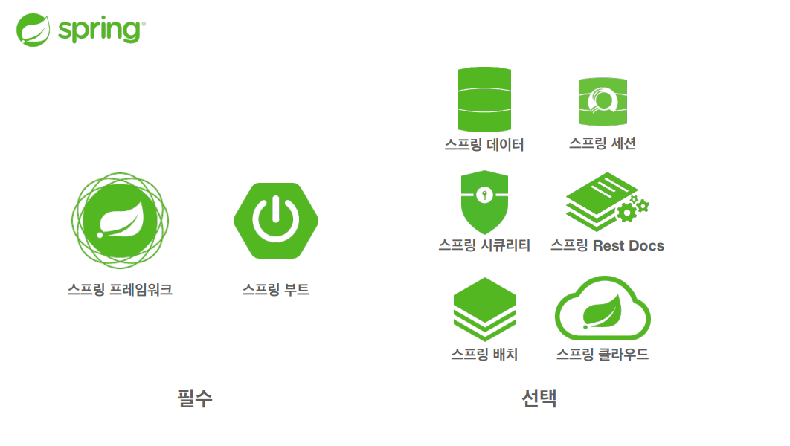
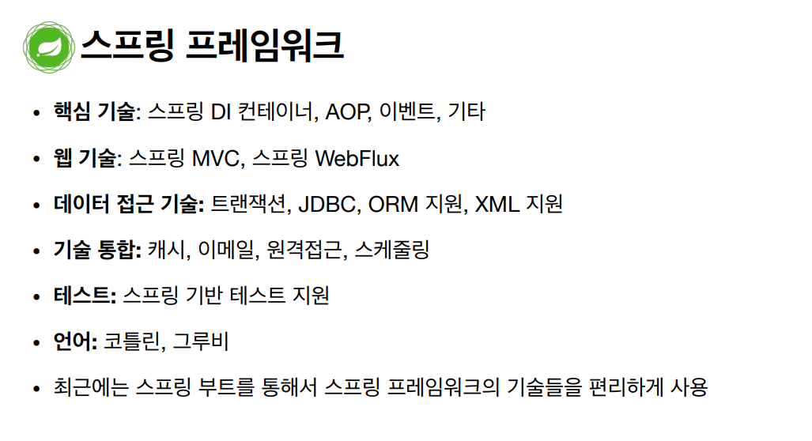
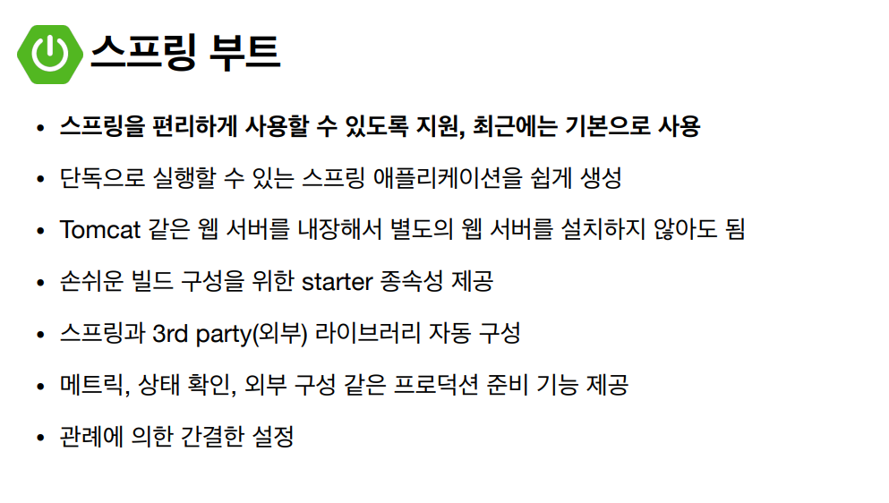

> # 스프링이란?

- 스프링 프레임워크가 가장 중요!!

> ### 스프링의 핵심 개념, 컨셉

- 스프링은 자바 언어 기반의 프레임워크

- 자바 언어의 가장 큰 특징 - 객체 지향 언어

- 스프링은 객체 지향 언어가 가진 강력한 특징을 살려내는 프레임워크

- 스프링은 좋은 객체 지향 애플리케이션을 개발할 수 있게 도와주는 프레임워크

> ### 객체 지향 특징

- 추상화, 캡슐화, 상속 다형성

- 객체 지향 프로그래밍은 컴퓨터 프로그램을 명령어의 목록으로 보는 시각에서 벗어나 여러개의 독립된 단위, 즉 '객체'들의 모임으로 파악하고자 하는 것이다. 각각의 객체는 메시지를 주고받고, 데이터를 처리할 수 있다.(협력)

- 객체 지향 프로그래밍은 프로그램을 유연하고 변경이 용이하게 만들기 때문에 대규모 소프트웨어 개발에 많이 사용된다.

#

> #### 다형성

- 실세계와 객체 지향을 1:1로 매칭x

- 그래도 실세계의 비유로 이해하기에는 좋음

- 역할과 구현으로 세상을 구분
  
  - 역할과 구현으로 구분하면 세상이 단순해지고, 유연해지며 변견동 편리해진다.
  
  - 장점
    
    - 클라이언트는 대상의 역할(인터페이스)만 알면 된다.
    
    - 클라이언트는 구현 대상의 내부 구조를 몰라도 된다.
    
    - 클라이언트는 구현 대상의 내부 구조가 변경되어도 영향을 받지 않는다.
    
    - 클라이언트는 구현 대상 자체를 변경해도 영향을 받지 않는다.

- 자바 언어의 다형성을 활용
  
  - 역할 = 인터페이스
  
  - 구현 = 인터페이스를 구현한 클래스, 구현 객체

- 객체를 설계할 때 역할과 구현을 명확히 분리

- 객체 설계시 역할(인터페이스)을 먼저 부여하고, 그 역할을 수행하는 구현 객체 만들기

> ### 좋은 객체 지향 설계의 5가지 원칙(SOLID)

- SRP: 단일 책임 원칙

- OCP: 개방 - 폐쇄 원칙

- LSP: 리스코프 치환 원칙

- ISP: 인터페이스 분리 원칙

- DIP: 의존관계 역전 원칙
1. SRP 단일 책임 원칙
   
   - 한 클래스는 하나의 책임만 가져야 한다
   
   - 하나의 책임이라는 것은 모호하다.
     
     - 클 수 있고, 작을 수 있다.
     
     - 문맥과 상황에 따라 다르다.
   
   - 중요한 기준은 변경이다. 변경이 있을 때 파급효과가 적으면 단일 책임 원칙을 잘 따른 것

2. OCP 개방-폐쇄 원칙
   
   - 소프트웨어 요소는 확장에는 열려 있으나 변경에는 닫혀 있어야 한다
   
   - 이런 거짓말 같은 말이? 확장을 하려면, 당연히 기존 코드를 변경?
   
   - 다형성을 활용
   
   - 인터페이스를 구현한 새로운 클래스를 하나 만들어서 새로운 기능을 구현
   
   - 지금까지 배운 역할과 구현의 분리를 생각해보자
   
   - 문제점
     
     - 구현 객체를 변경하려면 클라이언트 코드를 변경해야 한다.
     
     - 분명 다형성을 사용했지만 OCP 원칙을 지킬 수 없다.
     
     - 이 문제를 어떻게 해결해야 하나? - 객체를 생성하고, 여관관계를 맺어주는 별도의 조립, 설정자가 필요하다

3. LSP 리스코프 치환 원칙
   
   - 프로그램의 객체는 프로그램의 정확성을 깨뜨리지 않으면서 하위 타입의 인스턴스로 바꿀 수 있어야 한다
   
   - 다형성에서 하위 클래스는 인터페이스 규약을 다 지켜야 한다는 것, 다형성을 지원하기 위한 원칙, 인터페이스를 구현한 구현체는 믿고 사용하려면, 이 원칙이 필요하다.
   
   - 단순히 컴파일에 성공하는 것을 넘어서는 이야기
     
     ex) 자동차 인터페이스의 엑셀은 앞으로 가라는 기능, 뒤로 가게 구현하면 LSP위반, 느리더라도 앞으로 가야함

4. ISP 인터페이스 분리 워칙
   
   - 특정 클라이언트를 위한 인터페이스 여러개가 범용 인터페이스 하나보다 낫다
   
   - 자동차 인터페이스 -> 운전 인터페이스, 정비 인터페이스로 분리
   
   - 사용자 클라이언트 -> 운전사 클라이언트, 정비사 클라이언트로 분리
   
   - 분리하면 정비 인터페이스 자체가 변해도 운전자 클라이언트에 영향을 주지 않음
   
   - 인터페이스가 명확해지고, 대체 가능성이 높아진다.

5. DIP 의존관계 역전 원칙
   
   - 프로그래머는 '추상화에 의존해야지, 구체화에 의존하면 안된다.' 의존성 주입은 이 원칙을 따르는 방법중 하나다.
   
   - 쉽게 이야기해서 구현 클래스에 의존하지 말고, 인터페이스에 의존하라는 뜻
   
   - 앞에서 이야기한 역할에 의존하게 해야 한다는 것과 같다. 객체 세상도 클라이언트가 인터페이스에 의존해야 유연하게 구현체를 변경할 수 있다! 구현체에 의존하게 되면 변경이 아주 어려워진다.

> ### 정리

- 객체 지향의 핵심은 다형성

- 다형성 만으로는 쉽게 부품을 갈아 끼우듯이 개발할 수 없다.

- 다형성 만으로는 구현 객체를 변경할 때 클라이언트 코드도 함께 변경된다.

- 다형성 만으로 OCP, DIP를 지킬 수 없다.

- 뭔가 더 필요

---

### 스프링은 다음 기술로 다형성 + OCP, DIP를 가능하게 지원

- DI(Dependency Injection): 의존관계, 의존성 주입

- DI 컨테이너 제공

- 클라이언트 코드의 변경 없이 기능 확장

- 쉽게 부품을 교체하듯이 개발
